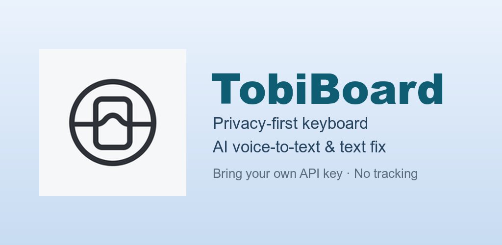

<div align="center">


# WisprBoard

### Speak any language. Fix any typo. Keep your data yours.

An open-source Android keyboard with AI voice-to-text and a one-tap text fixer — powered by [OpenRouter](https://openrouter.ai/), with **zero data retention on by default**.

[](https://github.com/Turtlecute33/WisprBoard/releases/latest)

<br>



</div>

<br>

## Why WisprBoard?

Ever tried writing a long message in a language you only half-speak? Or hunted for that one word your fingers can't find on a tiny screen?

**Talk instead. Let AI clean it up.**

WisprBoard is the keyboard I wished existed: a normal Android keyboard with two extra buttons — a **mic** that transcribes your voice, and a **fix** button that rewrites whatever you just typed. Both run through your own [OpenRouter](https://openrouter.ai/) key, so you pick the model, you control the cost, and nothing routes through a server we own.

No subscription. No account. No telemetry. Just a keyboard.

<br>

## ✨ What it does

🎙️ **Voice to text, in any language**
Long-press Return, tap the mic, speak. Perfect for writing in languages where typing is slow or your accent makes the system keyboard guess wrong.

✍️ **Text fixer & improver**
Wrote something messy in your second language? Select it, hit fix, and the model rewrites it — typos gone, grammar tidy, tone intact.

🌍 **Bring your own model**
Whisper, GPT, Claude, Gemini, Llama — whatever OpenRouter offers. Swap models the moment a better one ships.

🔒 **Zero data retention by default**
WisprBoard asks OpenRouter to use only [zero-data-retention endpoints](https://openrouter.ai/docs/use-cases/zero-data-retention) when your model supports them. Your audio and text aren't logged or stored. You can turn this off, but it's on out of the box.

🪶 **Everything HeliBoard does**
Built on the excellent [HeliBoard](https://github.com/Helium314/HeliBoard) — multilingual layouts, glide typing, suggestions, themes. WisprBoard adds AI on top without taking anything away.

<br>

## 🆚 WisprBoard vs HeliBoard

|                                         | HeliBoard | WisprBoard |
| --------------------------------------- | :-------: | :--------: |
| Everything HeliBoard does               |     ✅     |     ✅      |
| Installs alongside HeliBoard            |     —     |     ✅      |
| Voice-to-text via OpenRouter            |     —     |     ✅      |
| Text Fix (rewrite selected text)        |     —     |     ✅      |
| Zero Data Retention enforced by default |     —     |     ✅      |
| API key encrypted on-device             |     —     |     ✅      |

If you don't want AI features, stay on HeliBoard — it's wonderful as-is.

<br>

## 🛡️ Privacy, plainly

I built this because I love open source and I don't trust closed AI keyboards with my words. Here's the honest version:

- **No backend.** WisprBoard talks straight to OpenRouter. There's no WisprBoard server in between.
- **No telemetry, no analytics, no tracking.** Ever.
- **Your key stays yours.** Encrypted via Android Keystore, excluded from cloud backups, never written to logs.
- **AI is opt-in.** Both features are off until you paste a key.
- **ZDR by default.** Voice and text travel only through endpoints that don't log them, when the model offers it. If it doesn't, WisprBoard tells you and falls back so things still work.

What WisprBoard *can't* promise: once your audio reaches OpenRouter and the model provider, their policies apply. [Read OpenRouter's policy](https://openrouter.ai/privacy) before pointing this at sensitive content.

<br>

## 🚀 Get started

1. **Download** the APK from [Releases](https://github.com/Turtlecute33/WisprBoard/releases/latest).
2. **Enable** WisprBoard in *Settings → System → Keyboards*.
3. **Add a key** from [openrouter.ai/keys](https://openrouter.ai/keys) into *WisprBoard Settings → Voice Input*.
4. **Long-press Return** → tap the mic → start talking.

That's it. WisprBoard installs side-by-side with HeliBoard, so you can keep both.

<br>

## 🛠️ Build from source

```bash
git clone https://github.com/Turtlecute33/WisprBoard.git
cd WisprBoard
./gradlew assembleDebug
```

Needs JDK 17, Android SDK 35, NDK `28.0.13004108`. APK lands in `app/build/outputs/apk/debug/`.

<br>

## 💛 Open source, top to bottom

WisprBoard stands on the shoulders of giants:

- [**HeliBoard**](https://github.com/Helium314/HeliBoard) — the keyboard this fork is built on.
- [**OpenBoard**](https://github.com/openboard-team/openboard) and [**AOSP LatinIME**](https://android.googlesource.com/platform/packages/inputmethods/LatinIME/) — the foundation of both.
- Original icon by [Fabian OvrWrt](https://github.com/FabianOvrWrt) and [The Eclectic Dyslexic](https://github.com/the-eclectic-dyslexic).

Issues and PRs are welcome. A few rules inherited from upstream:

- The input path is fragile and perf-sensitive. New behavior should be opt-in.
- One purpose per PR.
- No new internet permissions, no proprietary blobs, no telemetry.
- Translations live on Weblate upstream — please don't edit them here.

<br>

## 📜 License

[GPL v3](/LICENSE). AOSP-derived portions are also available under [Apache 2.0](LICENSE-Apache-2.0).

<div align="center">
<br>
<sub>Made with care for everyone who writes in more than one language.</sub>
</div>
